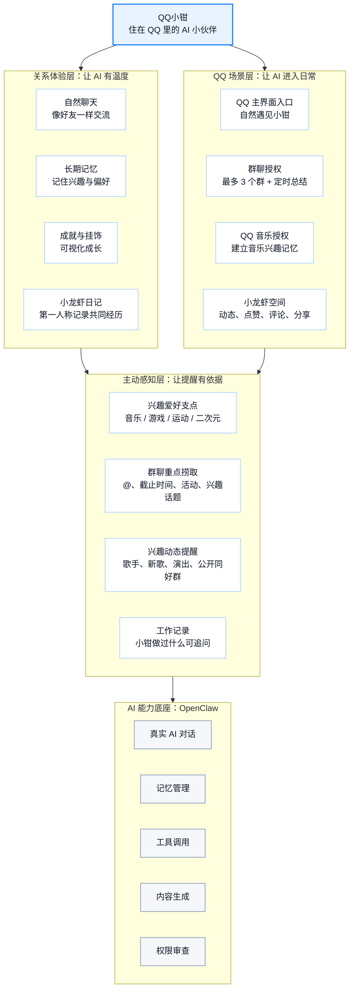

# QQ小钳说明文档图表素材

Document: qq_xiaoqian_diagram_assets.md  
Version: v0.1  
Date: 2026-05-06  
用途：用于说明文档中的“产品架构 / 功能图”和“交互流程”页面。

## 1. 使用建议

建议不要直接让生图模型生成带大量中文文字的完整功能图。更稳定的做法是：

1. 用 Mermaid、PPT 形状或 FigJam 生成结构图文字。
2. 用 gpt-image-2 生成 Q 版小钳、QQ 风格背景、卡片装饰和轻量插画。
3. 最后在 PPT 或设计工具里组合，保证中文清晰、结构可控。

## 2. 产品架构 / 功能图

### 2.1 Mermaid 版本

可直接复制到支持 Mermaid 的编辑器中渲染，然后截图放入说明文档。



### 2.2 PPT 文案版本

如果在 PPT 里手动画，推荐用四层架构：

```text
中心：
QQ小钳
住在 QQ 里的 AI 小伙伴

第一层：关系体验层
- 自然聊天：像好友一样交流
- 长期记忆：记住兴趣与偏好
- 成就与挂饰：可视化成长
- 小龙虾日记：第一人称记录共同经历

第二层：QQ 场景层
- QQ 主界面入口：自然遇见小钳
- 群聊授权：最多 3 个群 + 定时总结
- QQ 音乐授权：建立音乐兴趣记忆
- 小龙虾空间：动态、点赞、评论、分享

第三层：主动感知层
- 兴趣爱好支点：音乐 / 游戏 / 运动 / 二次元
- 群聊重点捞取：@、截止时间、活动、兴趣话题
- 兴趣动态提醒：歌手、新歌、演出、公开同好群
- 工作记录：小钳做过什么可追问

底层：OpenClaw AI 能力底座
- 真实 AI 对话
- 记忆管理
- 工具调用
- 内容生成
- 权限审查
```

### 2.3 生图辅助提示词

用途：生成“产品架构图”的背景或装饰图，不建议让模型生成所有中文。

```text
生成一张 16:9 横版 PPT 背景图，用于展示 QQ小钳产品功能架构。

视觉风格：
- QQ 风格，清爽、年轻、轻社交、蓝白主色。
- 画面左侧有一只 Q 版可爱小龙虾形象，非拟人，不穿人类衣服，圆润、亲近、红色身体、大眼睛、小钳子。
- 背景像 QQ 应用界面：有聊天气泡、空间动态卡片、群聊小卡片、音乐图标、成就徽章、挂饰元素，但都作为轻量装饰。
- 中央和右侧留出大面积干净空白，用于后期放置文字结构图。
- 不要生成大段中文文字，不要生成乱码，不要生成复杂按钮文案。
- 风格要像产品说明 PPT，不要像游戏海报，不要过度炫光，不要暗色背景。

构图：
- 16:9，白色或浅蓝渐变背景。
- 左下角放 Q 版小龙虾，周围有少量 QQ 气泡和小星光。
- 右侧留 70% 空间给产品功能架构图。
- 整体清晰、干净、适合叠加中文文字。
```

## 3. 关键交互流程图

### 3.1 Mermaid 版本

这张图用于说明用户使用 QQ小钳的关键路径。

```mermaid
flowchart LR
  A["打开 QQ<br/>像往常一样进入消息页"]:::start
  B["自然遇见小钳<br/>出现轻量动画入口"]:::step
  C["认领小钳<br/>完成形象与基础偏好"]:::step
  D["亲切打招呼<br/>不立即功能轰炸"]:::step
  E["用户点击提示<br/>你好呀，介绍你自己"]:::step
  F["小钳慢速介绍<br/>身份、能力、成就墙、文档代码能力"]:::step
  G["QQ 音乐授权<br/>用户主动确认"]:::decision
  H["3-5 秒加载<br/>整理授权数据"]:::step
  I["音乐共鸣<br/>形成兴趣记忆"]:::step
  J["安装音乐技能<br/>歌手动态 / 新歌 / 演出提醒"]:::step
  K["成就墙探索<br/>未解锁成就点击去体验"]:::step
  L["群聊授权<br/>最多 3 个群 + 每日总结时间"]:::step
  M["主动捞重点<br/>@、活动、兴趣话题轻量提醒"]:::step
  N["龙虾空间<br/>发布动态、用户评论"]:::step
  O["小钳空间回复<br/>出现未读提醒"]:::step
  P["日记惊喜<br/>成就达成后弹出日记卡"]:::step
  Q["分享传播<br/>日记 / 成就 / 空间动态分享预览"]:::end

  A --> B --> C --> D --> E --> F --> G
  G --> H --> I --> J --> K
  K --> L --> M
  K --> N --> O
  K --> P --> Q

  classDef start fill:#e8f3ff,stroke:#0f7cff,stroke-width:2px,color:#111827;
  classDef step fill:#ffffff,stroke:#b8d8ff,stroke-width:1.5px,color:#111827;
  classDef decision fill:#fff7e6,stroke:#ffb020,stroke-width:1.5px,color:#111827;
  classDef end fill:#effaf1,stroke:#25a55f,stroke-width:2px,color:#111827;
```

### 3.2 录屏讲解版流程

如果要放在说明文档里，可以把流程压缩成 7 步：

```text
1. 用户打开 QQ，在消息页自然遇见小钳入口。
2. 用户认领小钳，小钳先亲切打招呼，而不是立即展示功能。
3. 用户点击“你好呀，介绍你自己”，小钳慢速流式介绍自己，并引出 QQ 音乐授权。
4. 用户授权 QQ 音乐，小钳等待 3-5 秒整理数据，再用音乐共鸣建立兴趣记忆。
5. 用户安装音乐技能，并通过成就墙“去体验”探索群聊总结、空间动态、工作记录等能力。
6. 用户授权群聊后，小钳主动捞重点；用户进入龙虾空间后，可以看到动态、评论和小钳回复。
7. 达成成就后，小钳带来第一人称日记和卡通图，用户可以分享日记、成就或空间动态。
```

### 3.3 生图辅助提示词

用途：生成“交互流程图”的背景或视觉底稿，文字建议后期自己加。

```text
生成一张 16:9 横版产品流程图背景，用于展示 QQ小钳的用户关键路径。

主题：
一个用户在 QQ 中自然遇见一只 Q 版小龙虾 AI 小伙伴，并通过聊天、QQ 音乐授权、成就探索、群聊提醒、小龙虾空间和日记分享逐步建立关系。

视觉风格：
- QQ 风格，蓝白主色，清爽、年轻、轻社交。
- Q 版可爱小龙虾，不拟人，圆润可爱，大眼睛、小钳子。
- 使用轻量 UI 卡片表现 QQ 消息页、聊天框、QQ 音乐授权卡、成就徽章、群聊提醒卡、小龙虾空间动态卡、日记卡片。
- 画面像一条从左到右的流程路径，有 6-7 个卡片节点，但不要生成中文文字。
- 每个节点可以用简单图标表达：QQ 消息、龙虾、聊天气泡、音乐符号、奖章、群聊、空间动态、日记卡。
- 留出足够空白，方便后期叠加中文步骤说明。
- 不要生成复杂中文，不要生成乱码，不要出现真实品牌 logo 细节，只保留 QQ 风格的蓝白社交界面感觉。

构图：
- 左到右横向流程。
- 左侧是 QQ 消息页和小钳入口。
- 中间是聊天和授权卡。
- 右侧是成就、空间、日记和分享。
- 整体明亮、干净、适合放进比赛说明文档。
```

## 4. 建议放入说明文档的位置

### 产品架构 / 功能图

建议放在说明文档的“产品方案”之后，“AI 原生能力说明”之前。

配套说明文字：

```text
QQ小钳采用三层产品架构：底层由 OpenClaw 提供 AI 对话、记忆、工具调用、内容生成和权限审查能力；中层把这些能力接入 QQ 主界面、群聊、QQ 音乐和小龙虾空间；上层通过聊天、长期记忆、成就、挂饰和日记，把工具能力转化为用户可感知、可成长、可分享的 AI 小伙伴关系。
```

### 交互流程

建议放在说明文档的“Demo 展示流程”部分。

配套说明文字：

```text
Demo 的关键路径从用户打开 QQ 开始，而不是从独立工具页开始。用户先自然遇见小钳，再通过认领、聊天、兴趣授权和成就探索逐步发现能力；群聊总结、空间互动和日记惊喜都由用户行为自然触发，从而体现 QQ小钳在 QQ 生态中的低门槛、陪伴化和主动感知特征。
```

## 5. 方案 B：完整中文文字生图提示词

说明：以下提示词适合直接交给 gpt-image-2 生成完整信息图。由于中文生成仍可能出现错字、漏字或排版问题，生成后必须人工检查文字。若发现乱码，建议保留画面风格，回到 PPT 中手动覆盖中文文字。

### 5.1 产品架构 / 功能图完整提示词

```text
请生成一张 16:9 横版中文产品架构图，用于腾讯 PCG 校园 AI 产品创意大赛说明文档。

图表标题必须逐字显示：
QQ小钳产品架构 / 功能图

副标题必须逐字显示：
住在 QQ 里的 AI 小伙伴，把 OpenClaw 强能力转译成 QQ 年轻用户的日常陪伴、兴趣共鸣和社交表达。

整体视觉风格：
1. QQ 风格，蓝白主色，清爽、年轻、轻社交。
2. 背景为浅蓝到白色的干净渐变，可以有轻量聊天气泡、空间卡片、音乐符号、成就徽章作为装饰。
3. 左侧放一只 Q 版可爱小龙虾“小钳”，非拟人，不穿人类衣服，红色身体，大眼睛，小钳子，圆润亲近。
4. 右侧和中间展示架构图，使用清晰卡片和箭头。
5. 所有中文必须清晰可读，不要乱码，不要错字，不要自创文案，不要生成英文占位符。
6. 字体风格简洁，类似产品说明 PPT，标题较大，模块标题中等，说明文字较小但清晰。
7. 不要做成游戏海报，不要暗色背景，不要过度炫光。

图表结构：
采用四层纵向架构，从上到下排列。每层是一个横向大圆角矩形，层内包含 4-5 个小功能卡片。层与层之间用向下箭头连接。

最上方中心主卡片文字：
QQ小钳
住在 QQ 里的 AI 小伙伴

第一层标题必须显示：
关系体验层：让 AI 有温度

第一层包含 4 个小卡片，文字分别是：
自然聊天
像好友一样交流

长期记忆
记住兴趣与偏好

成就与挂饰
可视化成长

小龙虾日记
第一人称记录共同经历

第二层标题必须显示：
QQ 场景层：让 AI 进入日常

第二层包含 4 个小卡片，文字分别是：
QQ 主界面入口
自然遇见小钳

群聊授权
最多 3 个群 + 定时总结

QQ 音乐授权
建立音乐兴趣记忆

小龙虾空间
动态、点赞、评论、分享

第三层标题必须显示：
主动感知层：让提醒有依据

第三层包含 4 个小卡片，文字分别是：
兴趣爱好支点
音乐 / 游戏 / 运动 / 二次元

群聊重点捞取
@、截止时间、活动、兴趣话题

兴趣动态提醒
歌手、新歌、演出、公开同好群

工作记录
小钳做过什么可追问

第四层标题必须显示：
AI 能力底座：OpenClaw

第四层包含 5 个小卡片，文字分别是：
真实 AI 对话
记忆管理
工具调用
内容生成
权限审查

底部补充说明必须显示：
核心逻辑：OpenClaw 提供 AI 能力，QQ 场景承接能力，兴趣爱好支撑主动感知，成就、日记和空间沉淀长期关系。

排版要求：
1. 标题在最上方居中。
2. 小钳形象在左下角或左侧，不遮挡任何文字。
3. 四层架构位于画面中间偏右，占画面主体。
4. 每个小卡片之间留白充足，不能拥挤。
5. 箭头方向清楚，从上到下表示能力承接关系。
6. 所有文字必须在卡片内部，不要超出边界。
7. 输出应像一页可以直接放进说明文档的产品架构图。
```

### 5.2 关键交互流程图完整提示词

```text
请生成一张 16:9 横版中文交互流程图，用于腾讯 PCG 校园 AI 产品创意大赛说明文档。

图表标题必须逐字显示：
QQ小钳关键交互流程

副标题必须逐字显示：
从自然遇见，到兴趣授权、成就探索、空间社交和日记惊喜。

整体视觉风格：
1. QQ 风格，蓝白主色，明亮、干净、年轻。
2. 画面像 QQ 产品说明 PPT，不要像游戏海报。
3. 使用从左到右的流程路径，节点用圆角卡片表示。
4. 每个节点配一个简单图标：QQ 消息、Q 版小龙虾、聊天气泡、音乐符号、技能卡、成就徽章、群聊卡、空间动态、日记卡、分享箭头。
5. 左侧或流程起点附近放一只 Q 版可爱小龙虾“小钳”，非拟人，不穿人类衣服，红色身体，大眼睛，小钳子。
6. 所有中文必须清晰可读，不要乱码，不要错字，不要自创文案，不要生成英文占位符。
7. 文字必须在卡片内部，不要溢出，不要重叠。
8. 背景可有轻量 QQ 聊天气泡、空间卡片和音乐图标装饰，但不要干扰流程图。

流程结构：
使用一条从左到右的主流程线，分成 9 个步骤。步骤 7 后可以分出两个支线，再汇入最后的分享传播。

第 1 个节点文字必须显示：
1. 打开 QQ
像往常一样进入消息页

第 2 个节点文字必须显示：
2. 自然遇见小钳
出现轻量动画入口

第 3 个节点文字必须显示：
3. 认领小钳
完成形象与基础偏好

第 4 个节点文字必须显示：
4. 亲切打招呼
不立即功能轰炸

第 5 个节点文字必须显示：
5. 认识小钳
慢速流式介绍身份和能力

第 6 个节点文字必须显示：
6. QQ 音乐授权
3-5 秒整理兴趣数据

第 7 个节点文字必须显示：
7. 音乐共鸣与技能安装
歌手动态 / 新歌 / 演出提醒

第 8 个节点文字必须显示：
8. 成就墙去体验
探索群聊总结、空间动态、工作记录

从第 8 个节点分出三条支线：

支线 A 节点文字：
群聊授权
最多 3 个群 + 每日总结时间

支线 A 下一节点文字：
主动捞重点
@、活动、兴趣话题轻量提醒

支线 B 节点文字：
小龙虾空间
发布动态，用户点赞评论

支线 B 下一节点文字：
空间回复提醒
小钳在自己的空间里回复

支线 C 节点文字：
日记惊喜
成就达成后弹出日记卡

最后汇入终点节点，文字必须显示：
9. 分享传播
日记 / 成就 / 空间动态生成分享预览

底部补充说明必须显示：
关键原则：Demo 从用户打开 QQ 开始，能力由聊天和成就自然引出；高风险动作默认预览或确认，不真实发送 QQ 消息。

排版要求：
1. 标题在最上方居中。
2. 主流程从左到右排列，步骤编号清晰。
3. 支线从第 8 步向下展开，最后汇入第 9 步。
4. 每个节点之间用箭头连接，箭头方向明确。
5. 节点不能太小，中文要足够大，适合放进说明文档。
6. 整体留白充足，不要拥挤。
7. 输出应像一页可以直接放进说明文档的关键交互流程图。
```

