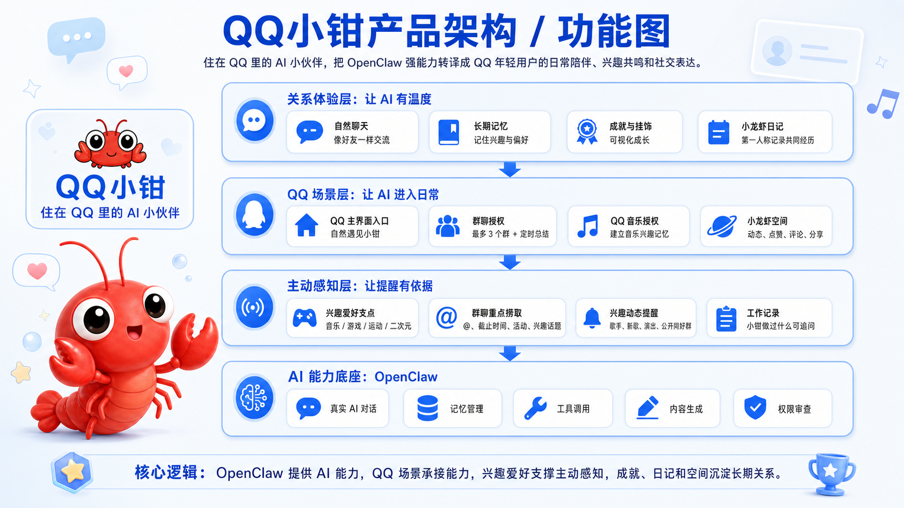
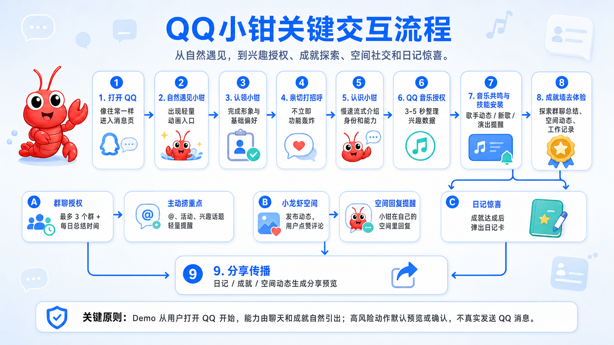

封面
作品名称：QQ小钳：新时代 AI 赋能的 QQ 小伙伴
参赛赛道：题目3：用AI玩转QQ养虾，解锁社交新玩法
选手姓名：肖镔珂
Demo链接：https://qqclaw.xiaobinke.com
Github地址：

模块一：用户洞察和问题定义
## 目标用户

QQ小钳面向 QQ 生态中的年轻活跃用户，重点覆盖青少年、高校学生、兴趣圈层用户、轻社交用户，以及希望 AI 更有温度的用户。

公开资料显示，QQ 仍是一个 5 亿级月活产品。腾讯 2025 年第四季度及全年业绩披露，QQ 移动终端月活跃账户数为 5.08 亿。腾讯营销洞察 TMI《年轻世代 QQ 社交行为洞察报告（2026）》显示，18-35 岁年轻世代占 QQ 用户超过半数，67% 的年轻世代每日使用 QQ，日均使用时长接近 3 小时。

这说明 QQ小钳不是面向一个边缘场景，而是面向 QQ 当前用户画像中的年轻活跃核心层。该群体仍活跃在聊天、群聊、空间、兴趣圈层、游戏、音乐、校园协作和个性化表达等场景中。

QQ小钳优先服务其中三类需求更明显的用户：

1. **需要陪伴和情绪连接的用户**  
   他们不满足于冷冰冰的 AI 问答，希望 AI 能记住自己、理解自己，并在长期互动中形成关系感。

2. **有兴趣爱好和圈层社交需求的用户**  
   他们关注音乐、游戏、二次元、运动、追星、展会、比赛等内容，希望有人能理解自己的兴趣，并围绕兴趣带来提醒、共鸣和社交机会。

3. **希望降低信息负担的 QQ 用户**  
   他们活跃在课程群、项目群、社团群、兴趣群和好友空间中，不想频繁刷群，但又担心错过和自己相关的信息。

## 调研发现、用户痛点与解决方案

### 资料依据

本节痛点来自三类资料：

1. **QQ 用户与年轻世代社交资料**  
   腾讯财报显示 QQ 移动终端月活为 5.08 亿。TMI《年轻世代 QQ 社交行为洞察报告（2026）》显示，18-35 岁用户占 QQ 用户超过半数，67% 每日使用，日均近 3 小时；年轻世代线上社交核心诉求中，63% 渴望真实情绪联结，58% 希望开拓视野，57% 追求小众兴趣共鸣，81% 认为线上社交是生活重要组成部分。

2. **QQ 使用场景资料**  
   TMI 报告显示，年轻世代使用 QQ 的目的覆盖工作/学习沟通、找同好、圈内互动、亲友联系和娱乐消遣等多类场景，其中工作/学习沟通为 38%，交朋友找同好为 36%，圈子内保持互动为 34%，亲友互动联系为 32%，娱乐消遣为 30%。同时，年轻人在 QQ 上的社交类型包括熟人社交、陌生人社交、兴趣社交和广场社交，其中兴趣社交占 40.8%。

3. **AI 使用与陪伴趋势资料**  
   CNNIC《生成式人工智能应用发展报告（2025）》显示，截至 2025 年 6 月，我国生成式 AI 用户规模达 5.15 亿，普及率为 36.5%，40 岁以下用户占 74.6%；但最广泛使用场景仍是回答问题，占 80.9%。这说明 AI 已快速普及，但大众使用仍偏问答和工具型。Common Sense Media 2025 年 AI companion 调研显示，美国 13-17 岁青少年中接近四分之三使用过 AI companion，说明“AI 陪伴”正在成为值得关注的全球趋势。该数据只作为趋势参考，不直接等同于中国 QQ 用户比例。

### 痛点、依据与解决方案

| 资料依据 | 用户痛点 | 使用场景 | QQ小钳怎么解决 |
| --- | --- | --- | --- |
| TMI 报告显示，63% 年轻世代渴望真实情绪联结；CNNIC 报告显示，生成式 AI 最广泛的使用场景仍是回答问题，占 80.9%。 | **AI 工具太工具化，缺少长期关系感。** 用户知道 AI 能回答问题，但使用路径仍像临时工具，用完即走，难以形成持续陪伴。 | 用户第一次打开 QQ，看到小钳动画入口，认领后先收到亲切打招呼，而不是功能列表。 | QQ小钳把 AI 从一次性工具变成住在 QQ 里的小伙伴。它会聊天、记住兴趣、写日记、获得成就、佩戴挂饰、发布龙虾空间动态，让用户持续感知到陪伴和成长。 |
| CNNIC 报告显示，生成式 AI 用户规模已达 5.15 亿，但主流使用仍集中在回答问题、日常办公、休闲娱乐和创作内容；本项目周边同学定性调研也发现，很多人觉得 OpenClaw 很强，但没有稳定办公或编码需求，也觉得 Agent、技能、授权和工作流偏复杂。 | **强 AI 产品上手门槛高，普通用户缺少使用动机。** 用户觉得它厉害，却不知道什么时候该用，也不愿意先学习复杂工具链。 | 用户在聊天中问“小钳你还能做什么”，或在成就墙看到未解锁能力并点击“去体验”。 | QQ小钳把 OpenClaw 的复杂能力包装进 QQ 熟悉的聊天、空间、成就和兴趣互动中。用户不需要先理解 Agent 和工作流，而是通过聊天、兴趣授权、成就探索等轻量行为逐步发现 AI 能力。 |
| TMI 报告显示，57% 年轻世代追求小众兴趣共鸣，36% 使用 QQ 交朋友找同好，40.8% 参与兴趣社交。 | **AI 主动感知缺少连接支点。** 如果 AI 不知道用户真正关心什么，主动总结、提醒和推荐都可能变成无关推送。 | 用户授权 QQ 音乐后，小钳基于歌手、曲风和听歌偏好进行音乐共鸣，并建议安装音乐技能。 | QQ小钳用兴趣爱好作为主动感知依据。小钳根据用户表达和授权形成兴趣记忆，再围绕音乐、游戏、运动、二次元、追星等内容进行提醒，让每次主动出现都有“为什么和我有关”的理由。 |
| TMI 报告显示，年轻世代使用 QQ 的目的包括工作/学习沟通 38%、圈子内保持互动 34%、亲友互动联系 32%、娱乐消遣 30%。 | **QQ 信息分散，重要内容容易错过。** 用户不想频繁刷群，但又担心漏掉 @、课程通知、活动报名、兴趣动态和好友互动。 | 用户授权最多 3 个群并设置每日总结时间，小钳只在授权范围内捞出 @、截止时间、活动和兴趣话题。 | QQ小钳在用户授权后关注群聊、@ 消息、兴趣动态和公开社群信息，主动捞出和用户有关的内容，并用 QQ 内轻量卡片提醒用户，帮助用户判断是否回到原场景查看。 |
| 现有 AI 总结多是用户主动点击后获得摘要；QQ 的核心体验则发生在聊天、群聊、空间和好友互动中。TMI 报告也强调 QQ 同时承载熟人、兴趣、广场等多类型社交。 | **普通 AI 总结没有融入 QQ 社交语境。** 它能提高效率，但不一定带来 QQ 场景中的互动感、关系感和传播价值。 | 用户看到群聊重点卡后追问“我需要回什么”，小钳生成回复草稿；用户问“小钳今天做了什么”，小钳给出工作记录。 | QQ小钳把信息处理变成 QQ 内的互动：用户可以追问、生成回复草稿、查看工作记录、跳转原群，也可以把成果沉淀为成就、日记和龙虾空间动态。 |
| TMI 报告显示，年轻用户在 QQ 中重视情绪价值、兴趣探索、真实自我和个性表达；QQ 常用功能中也包含空间互动、个性装扮、QQ 秀等表达型功能。 | **AI 使用成果缺少可视化和社交表达。** 用户和 AI 的互动往往停留在聊天记录里，难以形成可展示、可分享的成长资产。 | 用户达成成就后点亮挂饰；小钳在合适时机写日记；用户进入小龙虾空间，看到动态、评论和小钳回复。 | QQ小钳通过成就墙、挂饰、日记卡片、龙虾空间和分享卡片，把用户的使用行为、兴趣偏好和小钳成长过程可视化，形成可以展示、评论和传播的 QQ 社交资产。 |

### 使用场景总结

| 场景 | 用户触发 | AI 作用 | 产品价值 |
| --- | --- | --- | --- |
| 初次遇见小钳 | 用户打开 QQ，在消息页看到小钳动画入口并完成认领。 | AI 用自然语言建立关系，避免一开始就变成功能说明。 | 降低 AI 工具距离感，让用户愿意开始互动。 |
| 兴趣共鸣与 QQ 音乐授权 | 用户点击“授权 QQ 音乐”，小钳等待 3-5 秒整理兴趣数据。 | AI 从授权数据中提取兴趣记忆，用同好语气生成音乐共鸣，并建议安装音乐技能。 | 把兴趣变成主动感知支点，让提醒有依据。 |
| 授权群聊与主动捞重点 | 用户选择最多 3 个群，并设置每日总结时间。 | AI 在授权范围内判断 @、截止时间、活动和兴趣话题是否值得提醒。 | 解决“不想频繁刷群但怕错过重点”的问题。 |
| 成就墙探索能力 | 用户点击未解锁成就的“去体验”。 | AI 根据当前记忆生成自然引导，再弹出对应功能卡片。 | 把复杂能力变成可探索、可成长的低门槛体验。 |
| 小龙虾空间社交 | 小钳发布动态，用户或好友评论。 | AI 在自己的空间中生成评论回复，并通过未读提醒通知用户。 | 让 AI 关系从聊天框延伸到 QQ 社交表达。 |
| 日记惊喜与分享 | 用户和小钳共同达成一定成就后，小钳提示“我写了一篇日记”。 | AI 基于共同经历生成第一人称日记和卡通图内容。 | 把使用过程转化为情绪价值和可分享资产。 |

### 资料来源

1. 腾讯 2025 年第四季度及全年业绩：QQ 移动终端月活跃账户数 5.08 亿。  
   https://en.prnasia.com/releases/apac/tencent-announces-2025-annual-and-fourth-quarter-results-525781.shtml

2. 腾讯营销洞察 TMI《年轻世代 QQ 社交行为洞察报告（2026）》（公开预览/转载资料）：18-35 岁年轻世代占比、每日使用、日均时长、社交诉求和 QQ 使用场景。  
   https://www.sdyanbao.com/detail/953067

3. CNNIC《生成式人工智能应用发展报告（2025）》相关公开报道：生成式 AI 用户规模、普及率、年龄结构和主要使用场景。  
   https://www.cenr.com.cn/Item/216419.aspx

4. Common Sense Media, Talk, Trust, and Trade-Offs: How and Why Teens Use AI Companions：AI companion 青少年使用趋势参考。  
   https://www.commonsensemedia.org/research/talk-trust-and-trade-offs-how-and-why-teens-use-ai-companions

模块二：产品方案设计

## 产品概述
QQ小钳是一款面向QQ年轻群体的养成系AI小伙伴，它通过专属记忆、兴趣共鸣和独立的社交空间，解决传统AI工具’被动响应、缺乏共同话题和情感连接'的痛点，实现从工具化问答到主动感知、主动关怀的范式转变。

## 核心功能

QQ小钳的核心功能可以分为四组：

1. **关系建立能力**  
   包括自然遇见、认领、聊天和长期记忆，解决 AI 工具太工具化、缺少长期关系感的问题，让用户从“使用工具”转向“认识小伙伴”。

2. **兴趣主动感知能力**  
   包括兴趣爱好、QQ 音乐授权、兴趣技能和公开兴趣社群发现，解决 AI 主动提醒缺少依据的问题。小钳基于兴趣记忆判断什么值得关注，让提醒更像“懂我的小伙伴在帮我留意”。

3. **QQ 信息处理能力**  
   包括群聊授权、主动捞重点、群聊总结、追问问答、回复草稿和工作记录，解决 QQ 群信息分散、重要内容容易错过、AI 行为不透明的问题。

4. **成长与社交表达能力**  
   包括成就墙、挂饰、小龙虾日记、小龙虾空间和分享卡片，解决 AI 使用成果难以可视化、难以沉淀关系和传播的问题。

## 产品架构

## 交互流程

## 创新点与差异化

QQ小钳的创新点不在于单独实现某一个 AI 功能，而在于将 AI 能力重新组织为 QQ 生态中的长期关系、主动感知和社交表达。相比通用 AI 助手、普通群聊总结工具或传统虚拟宠物，QQ小钳更强调 AI 与用户在 QQ 场景中的持续共处。

| 对比对象 | 传统方式 | QQ小钳的差异化 |
| --- | --- | --- |
| 通用 AI 助手 | 以问答和任务为主，用完即走。 | 以小伙伴关系为主，通过记忆、成就、日记和空间形成长期陪伴。 |
| 普通群聊总结 | 用户打开群后主动点击总结。 | 用户授权后，小钳主动关注不常打开的群，只提醒真正相关的重点。 |
| 普通信息推送 | 按内容或平台逻辑推送，容易打扰。 | 基于用户兴趣、长期记忆和授权范围主动感知，并解释提醒原因。 |
| 传统虚拟宠物 | 主要是喂养、装扮和娱乐陪伴。 | 具备 AI 对话、记忆、工具调用、主动感知和社交表达能力。 |
| 独立 AI 应用 | 需要用户主动打开新的工具。 | 嵌入 QQ 聊天、群聊、空间和兴趣生态，在原有使用路径中自然出现。 |
| 普通 AI 生成内容 | 内容停留在聊天记录里。 | 生成日记、成就、空间动态和分享卡片，沉淀为可展示的 QQ 社交资产。 |

### 1. 从“AI 工具”到“AI 小伙伴”

现有 AI 产品大多以问答、写作、办公、编程等任务为核心，用户通常在有明确需求时打开，用完即走。QQ小钳将 AI 能力包装成一个住在 QQ 里的小伙伴，通过自然聊天、长期记忆、成就、挂饰、日记和小龙虾空间，让用户在日常使用 QQ 的过程中持续感知 AI 的存在。

这种设计不是削弱 AI 能力，而是降低强 AI 产品的大众化使用门槛。用户不需要先理解 Agent、工具调用或工作流，而是通过聊天、兴趣授权和成就探索逐步发现小钳能做什么。

### 2. 从“被动响应”到“基于兴趣的主动感知”

普通 AI 助手通常等待用户提问，用户不问，AI 就不会出现。QQ小钳的核心差异在于主动感知：它会在用户授权的范围内，基于长期记忆和兴趣爱好判断哪些内容值得关注。

其中，兴趣爱好是主动感知的关键支点。小钳不会无差别推送信息，而是根据用户表达的兴趣、QQ 音乐等授权数据，以及用户选择的群聊范围，关注歌手动态、新歌演出、群聊 @、活动报名、截止时间和兴趣话题。每一次提醒都可以解释“为什么这件事和用户有关”，从而避免主动提醒变成打扰。

### 3. 从“单次总结”到“QQ 场景中的信息陪伴”

现有群聊总结能力通常发生在用户已经打开群聊之后，本质上是对当前群消息进行压缩。QQ小钳不以替代阅读为目标，而是服务于用户平时不常打开、但又不希望错过重要内容的群聊场景。

用户可以授权小钳关注有限数量的群，并设置每日总结时间。小钳只在授权范围内捞取 @、截止时间、活动和兴趣话题等重点内容，并用轻量卡片提醒用户。用户如果感兴趣，可以继续追问、查看原群或生成回复草稿。这种方式让 AI 从“用户点击后的工具”变成“帮用户留意重点的小伙伴”。

### 4. 从“聊天记录”到“可视化成长资产”

普通 AI 产品的使用成果大多停留在聊天记录中，用户很难回看、展示或分享。QQ小钳通过成就墙、挂饰、小龙虾日记、小龙虾空间和分享卡片，把用户与 AI 的互动过程沉淀为可视化资产。

例如，用户第一次和小钳对话、第一次授权群聊、第一次让小钳发布空间动态，都可以转化为成就和挂饰；当用户和小钳共同完成一定经历后，小钳会以第一人称写日记；小钳还拥有自己的空间，可以发布动态、展示成长，并在自己的空间中回复评论。这样，AI 不只是回答问题，而是在 QQ 生态中形成可被看见、可被互动、可被传播的关系。

### 5. 从“独立 AI 应用”到“腾讯生态协同”

QQ小钳不是一个孤立的 AI App，而是面向 QQ 生态设计的 AI 产品形态。它可以与 QQ 聊天、群聊、空间、QQ 音乐、腾讯视频、游戏、动漫、会员装扮等能力形成协同。

在能力层，QQ小钳可依托 OpenClaw、元宝 AI 或混元大模型提供理解、生成、总结、工具调用和审查能力；在场景层，它承接 QQ 的群聊、空间、兴趣圈层和好友关系；在商业层，它可以与 QQ 会员、超级会员、装扮商城和腾讯内容生态联动。相比独立 AI 应用，QQ小钳更容易利用 QQ 已有关系链和内容生态形成持续使用与传播。

### 6. 从“虚拟宠物”到“AI 赋能的社交伙伴”

QQ小钳并不是传统 QQ 宠物的复刻。传统虚拟宠物更多强调喂养、装扮和陪伴，而 QQ小钳在继承情感连接需求的基础上，加入了 AI 理解、长期记忆、主动感知、工具调用和社交表达能力。

因此，小钳不是被用户单向照顾的宠物，而是能理解用户、参与社交、主动关注重要信息，并与用户共同成长的 QQ AI 小伙伴。这是传统宠物养成与现代 AI Agent 能力结合后的新形态。

模块三：

AI 核心能力	QQ小钳的 AI 核心能力包括：自然语言对话、长期记忆、主动感知、群聊理解与总结、兴趣画像生成、回复草稿生成、工作记录生成、第一人称日记生成、空间动态生成、评论回复生成、卡通图生成提示词、工具调用与权限审查。其核心不是单点生成，而是“理解用户 -> 记住兴趣 -> 判断什么值得关注 -> 生成回应或卡片 -> 在权限边界内调用工具”。
AI 如何解决痛点	面对“AI 工具太工具化”的痛点，小钳通过自然聊天、长期记忆、日记和空间动态建立关系感；面对“OpenClaw 上手门槛高”的痛点，小钳把 Agent、技能、工具调用包装成 QQ 用户熟悉的聊天、成就和卡片；面对“主动提醒容易打扰”的痛点，小钳用兴趣爱好和 QQ 音乐授权作为主动感知依据；面对“QQ 信息分散”的痛点，小钳在用户授权群聊后主动捞取 @、截止时间、活动和兴趣话题；面对“AI 行为不透明”的痛点，小钳把总结、提醒、发布、回复等动作写入工作记录，用户可追问。
AI 技术方案	前端使用 React + TypeScript 构建 QQ 风格交互 Demo，并通过 openclawAiAdapter 接入 OpenClaw API；后端 openclaw-api 使用 Node.js + SQLite 维护用户记忆、兴趣画像、工作记录、工具调用记录、审查记录、日记和空间数据；模型层采用 OpenAI-compatible /chat/completions 接口，可适配 DeepSeek、Kimi 等兼容模型，配置缺失或调用失败时自动走 mock fallback，保证 Demo 稳定。AI 工作流包括：聊天上下文构建 -> 兴趣识别/记忆沉淀 -> 权限审查 -> 工具调用 -> 内容生成 -> 工作记录写入 -> 前端卡片化展示。

模块四：
## 落地可行性与商业化思考

### 落地可行性

QQ小钳具备较强的产品落地基础。该方案不是重新构建一个独立社交产品，而是以 AI 小伙伴的形态嵌入 QQ 现有生态，依托 QQ 已有的聊天、群聊、空间、兴趣圈层、个性装扮和会员体系，降低产品冷启动成本。

从能力基础看，腾讯已有元宝 AI、混元大模型、QQ 音乐、腾讯视频、游戏、动漫、QQ 空间、会员装扮等成熟业务能力。QQ小钳可以在此基础上，将大模型理解与生成能力、兴趣内容数据、空间互动能力、装扮体系和会员权益进行组合，形成“AI 陪伴 + 兴趣主动感知 + 成长展示 + 社交传播”的完整体验。

从上线路径看，QQ小钳可以采用分阶段落地方式。第一阶段聚焦低门槛认领、聊天、兴趣记忆、成就墙和基础装扮，验证用户对 AI 小伙伴形态的接受度；第二阶段接入 QQ 音乐、群聊摘要、空间动态和消息提醒，形成基于兴趣和授权的主动感知闭环；第三阶段扩展更多腾讯生态兴趣联动、多用户小钳互动、完整权限审查和会员装扮体系，提升产品留存和商业价值。

从资源需求看，产品落地主要需要 QQ 客户端入口与交互改造、AI 能力编排、权限与隐私审查、腾讯生态接口协同、小钳形象与动效设计、会员装扮资源配置等。整体方案建立在 QQ 既有用户、社交关系和内容生态之上，具备较好的工程实现与业务协同基础。

### 商业化思考

QQ小钳的商业化不应以限制基础 AI 能力为核心。基础聊天、兴趣记忆、轻量提醒、成就成长等能力应作为免费体验，降低年轻用户接触和使用 AI 的门槛，扩大产品覆盖面和社交传播基础。

在商业化承接上，QQ小钳更适合围绕 QQ 会员体系和个性化表达展开。小钳装扮、挂饰、空间主题、日记卡片样式、动态皮肤、特殊成就展示等内容，可以与 QQ 会员、超级会员或装扮商城联动，作为会员权益或增值装扮内容，促进 QQ 会员开通与续费。

同时，QQ小钳的兴趣主动感知能力也可以与腾讯内容生态形成协同。围绕音乐、视频、游戏、动漫、演出活动等兴趣内容，小钳可以在用户授权和兴趣记忆基础上提供动态提醒、活动入口和内容推荐，提升用户在腾讯生态内的活跃与转化。

因此，QQ小钳的商业化逻辑不是直接售卖 AI 问答能力，而是通过免费 AI 小伙伴体验扩大用户触达，再通过个性装扮、会员权益、空间表达和腾讯生态内容联动形成持续商业价值。
